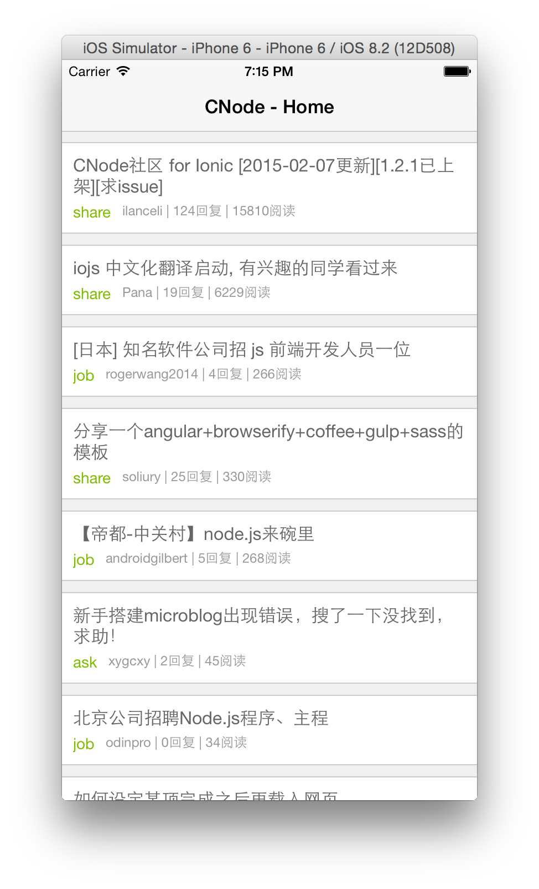
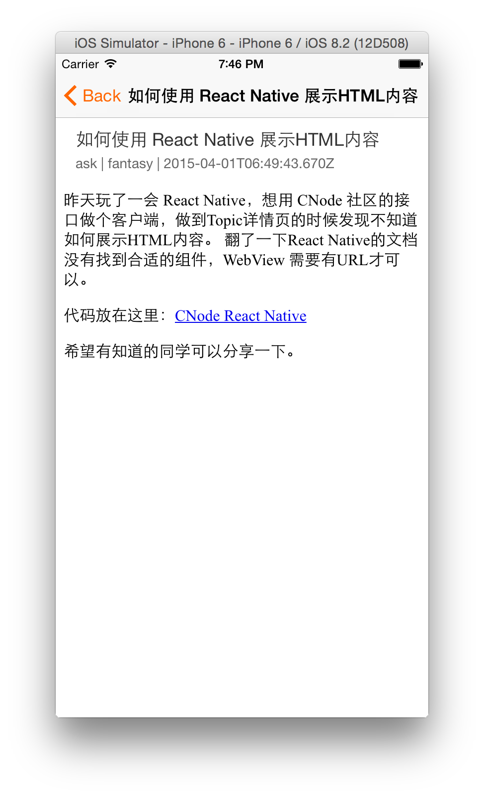

# CNode React Native

CNode iOS App - Made with [React Native](http://facebook.github.io/react-native/)

## Screenshot

 

## Develop

### API

[CNodeJS.org/api](https://cnodejs.org/api)

### Run the App

1. Clone this repository
2. `npm install` in the project folder
3. Open the CNode.xcodeproj with XCode
4. Click the run button

## License

The MIT License
